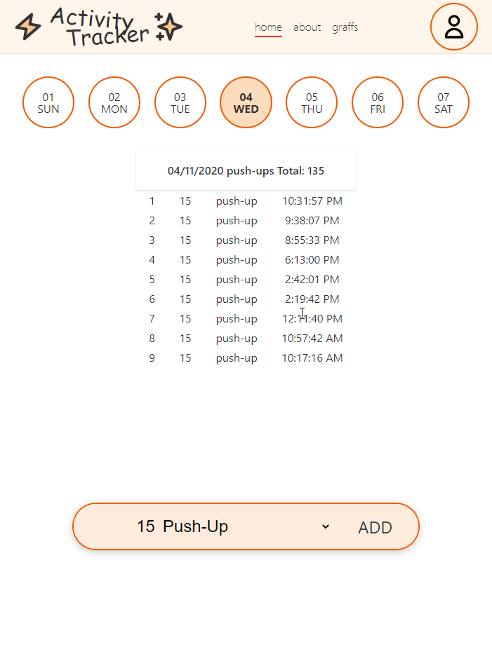

### todo

- [x] group activities together
- [ ] authorisation for backend (polka middleware?)
- [ ] style/animations
- [ ] find online service
- [ ] swipe to go back in time
- [x] using google cloud for the postgres db ~~make the postgres docker instead of local - easier to host i suppose~~

### preview

some work needs to be done before i put this online so added preview gif for the time being

### sapper-template

The default [Sapper](https://github.com/sveltejs/sapper) template, available for Rollup and webpack.
